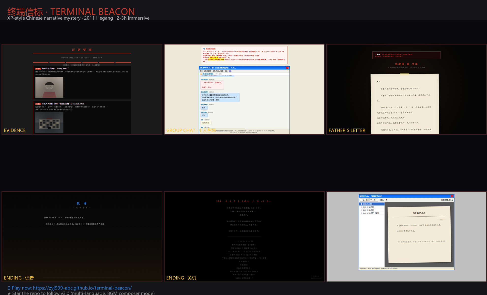
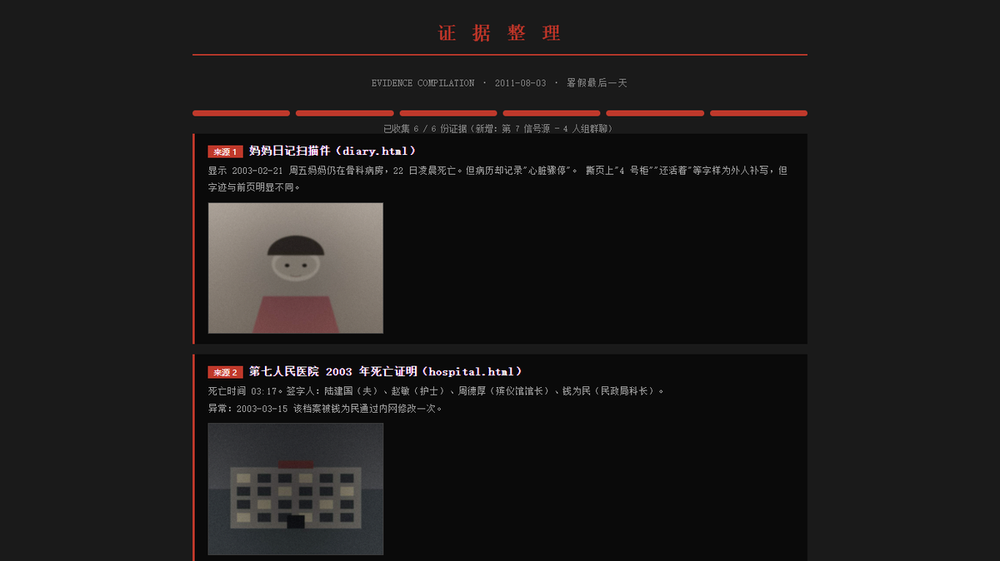
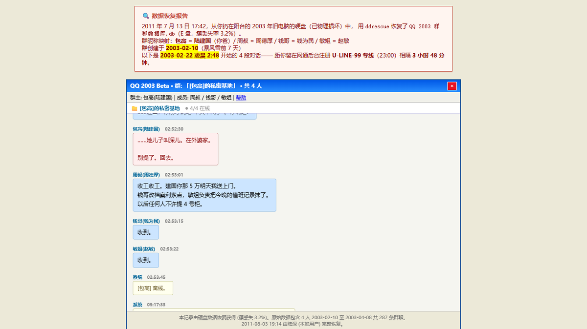
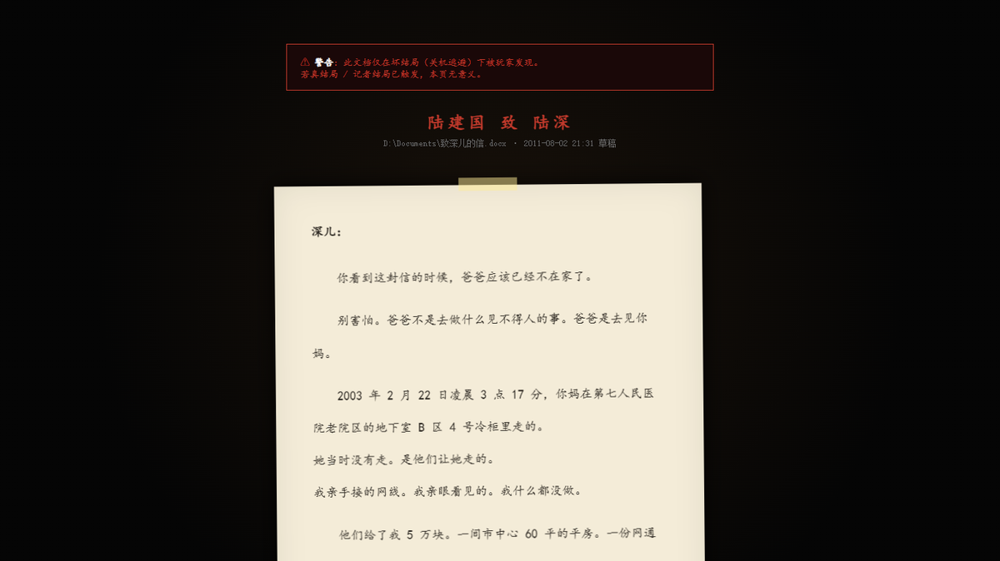
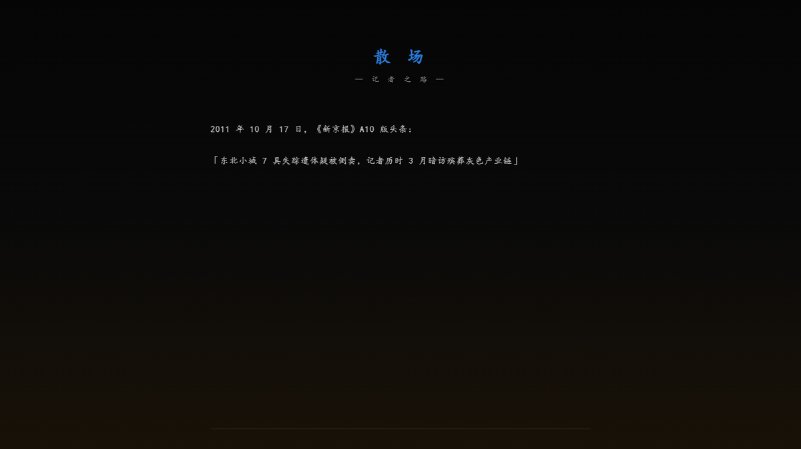

# 终端信标 · Terminal Beacon

> 2011 年东北鹤岗。一台父亲留下的 2003 年旧 Windows XP 台式机，藏着母亲"已死 8 年"的真相。

<p align="center">
  
</p>

<p align="center">
  <a href="https://zyj999-abc.github.io/terminal-beacon/"><b>▶ 立即开始游戏（2-3 小时沉浸）</b></a>
</p>

<p align="center">
  
  
  
  
</p>

---

## 🎭 这是什么

一个**中文互动悬疑叙事游戏**。用浏览器打开就能玩。

- **风格**：2006 年 Windows XP 桌面复刻 + 多站点信息交叉验证
- **时长**：2-3 小时沉浸（建议分段，每天 1 章）
- **结局**：4 个（3 主 + 1 隐藏）—— **全部不美满**
- **零依赖**：纯 HTML/CSS/JS + 7 段自研 BGM + 6 张程序生成图像
- **零付费**：完全免费

## 🖼️ 现场速览

<p align="center">
  
  
</p>
<p align="center">
  
  
</p>

## ✨ 设计理念

> **不是反转为目的，是让玩家"成为反推"的人。**

- **真实语义** — 所有谜题答案在剧情中能找到，不藏无关文字
- **多入口信息** — 不同视角拼出同一真相，互相矛盾才有戏
- **道德代价** — 玩家选择会影响父亲 / 受害人家属 / 沉冤昭雪的概率
- **时代沉浸** — 2006 XP 复刻 + 7 段 BGM + 6 张图像

## 🔐 密码在哪

> ⚠️ **不剧透任何密码**。所有答案都在游戏内可发现。

游戏中有 5 处需要解锁的信息源。**每个密码都基于现实语义** —— 例如身份证号、生日、2003 年某场暴风雪的具体日期、四人组群的群昵称等。打开游戏后，密保会告诉你在哪儿找。

> ❌ **无需 F12 查看源代码**。所有谜题在页面文案中。

## 🛠️ 技术栈

- **HTML 15 / CSS 3 / JS 1** = 19 文件
- **0 依赖**（无 React / Vue / jQuery / Node）
- **0 字体文件**（用系统 msyh.ttc）
- **7 段 WAV BGM**（自研 Python + numpy）
- **6 张 JPG 图像**（PIL 程序生成）

## 🚀 5 分钟本地运行

```bash
git clone https://github.com/zyj999-abc/terminal-beacon.git
cd terminal-beacon
python -m http.server 8000
# 打开 http://localhost:8000/
```

> 建议用 Chrome / Edge / Firefox 全屏 (F11) 游玩。

## 🧪 自动化测试

```bash
node test/walkthrough.mjs
# 输出 30+ 截图到 test/shots/
```

## ⚠️ 内容预警 (CW / TW)

本作无灵异，无 jump scare。但包含：
- 家庭暴力
- 长期隐瞒
- 遗体处置
- 角色自伤

**不建议 16 岁以下游玩**。对相关题材敏感的玩家请谨慎。

## 📅 路线图 v3.0

- [ ] 多语言 (英文 / 简中 / 繁中) 切换
- [ ] BGM composer 模式（玩家可调每页背景音）
- [ ] 二周目彩蛋（隐藏地图 + 4 号柜场景）
- [ ] 移动端 UI 优化
- [ ] PWA 离线缓存

## ⭐ 给一颗星吧

如果这个游戏让你想起童年、想起家人、想起某个你没说出口的真相 ——
**点一下右上角的 ★ Star** 让更多人能找到它。

## 📜 License

本作品采用**个人非商用许可**。详见 [LICENSE](LICENSE) 文件。

> **个人使用**: ✅ 免费<br>
> **二次创作 / 改编**: ✅ 需保留原作者署名<br>
> **商用 / 商业用途**: ❌ **必须先在 [GitHub Issues](https://github.com/zyj999-abc/terminal-beacon/issues) 申请授权**

## 🤝 致谢

灵感来源：中国 80/90 后"暴风雪集体记忆" + 真实的人间悲剧。

---

<p align="center">
  <b>Terminal Beacon · v2.0 · 2026</b><br>
  Made with ⚡ by Beacon · 鹤岗 · 阴
</p>
